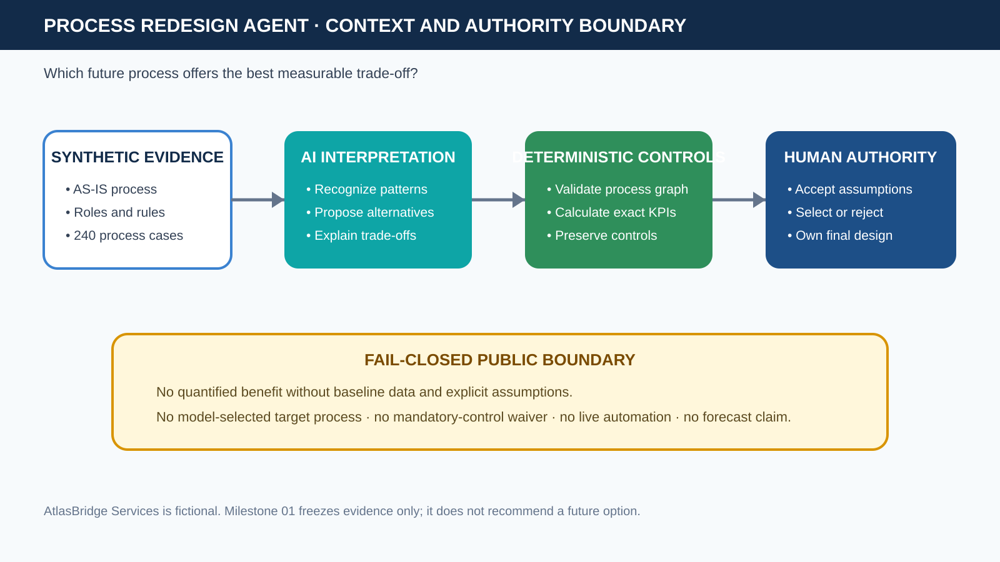

# Process Redesign Agent

**Compare credible future processes without turning estimates into promises or
letting a model choose the business design.**

> **Decision question:** Which future process offers the best measurable
> trade-off?

This repository is the third proof in Mounir Dameur's public business-analysis
agent portfolio. It will transform a fictional customer-onboarding AS-IS process
into multiple controlled TO-BE options, calculate their effects with a
deterministic KPI engine, expose assumptions and control constraints, and pause
for a human selection with rationale.

## Current milestone

`01-case-and-evidence` freezes the synthetic AtlasBridge Services baseline:
process scope, roles, rates, business rules, target constraints, 240 deterministic
process instances, expected AS-IS KPIs, known bottlenecks, and a content-digest
manifest.

No future option is selected in this milestone. No live process automation,
external write, deployment, private company data, or forecast claim is included.

## Frozen AS-IS result



| Baseline observation | Result |
|---|---:|
| Synthetic process instances | 240 |
| Average / P90 cycle time | 1141.6375 / 1885 working minutes |
| Wait share of cycle | 89.08% |
| SLA attainment | 53.75% |
| First-pass yield | 61.67% |
| Activation audit evidence | 92.50% |

The measurements expose why redesign is necessary, but they do not choose a
future process. The preferred trade-off will be decided only after at least two
valid TO-BE options preserve every mandatory control and a human accepts the
assumptions.

## Planned six-branch evidence path

| Branch | Public proof |
|---|---|
| `01-case-and-evidence` | Trusted synthetic AS-IS baseline and known KPI results |
| `02-analysis-models` | Validated process graph, bottlenecks, control gaps, and traceability |
| `03-agent-design` | Three typed TO-BE options, scenario calculator, and authority boundaries |
| `04-working-vertical` | Analyze → compare → human select → transformation backlog |
| `05-evaluation` | KPI agreement, control preservation, failure tests, security, and CI |
| `06-public-case-study` | Visual README, reproducible demo, measured claims, and limitations |

## Local verification

```bash
PYTHONPATH=src python scripts/verify_case.py
PYTHONPATH=src python scripts/generate_case.py --check
PYTHONPATH=src python -m unittest discover -s tests -v
python scripts/scan_public_boundary.py
```

The software is Apache-2.0. Original synthetic data and documentation are CC BY
4.0. See [`LICENSE`](LICENSE) and [`DATA_LICENSE.md`](DATA_LICENSE.md).
