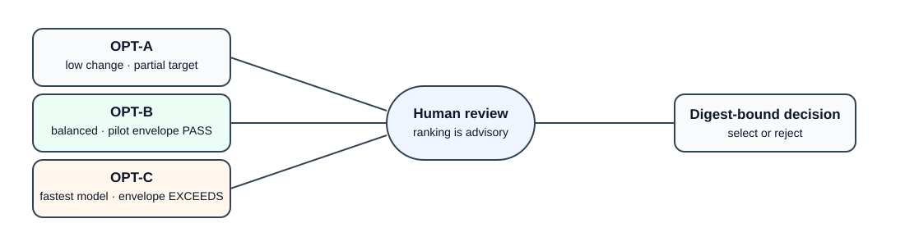
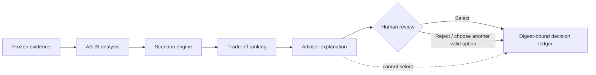

# Process Redesign Agent

**Compare credible future processes without turning estimates into promises or letting an agent make the business decision.**

This public BSA/agentic-engineering case study starts from a frozen fictional customer-onboarding process, measures its bottlenecks, models three controlled TO-BE alternatives, scores their trade-offs, and requires a human to select the future process against the exact comparison digest.

> **Decision question:** What future process offers the best trade-off?

## Frozen AS-IS evidence

The synthetic AtlasBridge baseline contains 240 process instances over 30 business days.

| Baseline observation | Result |
|---|---:|
| Average cycle time | 1,141.64 working min |
| P90 cycle time | 1,885 working min |
| Waiting share | 89.08% |
| SLA attainment | 53.75% |
| First-pass yield | 61.67% |
| Exception rate | 38.33% |
| Average labor cost | USD 86.11 / case |
| Activation audit evidence | 92.50% |

The largest measured queue is exception resolution, followed by document validation, compliance screening, risk review, and account activation. Runtime analysis is evidence-linked and does not read the evaluation-only bottleneck answer key.

## Three future-state options

| Option | Design | Main benefit | Main trade-off |
|---|---|---|---|
| **OPT-A** | Controlled incremental | Lowest effort and change risk | Does not reach the target operating envelope |
| **OPT-B** | Balanced parallel-control | Strong queue reduction while remaining inside the synthetic pilot envelope | Moderate change and implementation effort |
| **OPT-C** | Automation-first | Strongest modeled operating performance | Exceeds the 12-week / USD 180k pilot envelope and carries highest change risk |

All three must preserve C-01 through C-05, including named human approval for every high-risk activation and controlled handling of exceptions.



## Default result

With the published default weights, **OPT-B — Balanced parallel-control redesign** is the highest-scoring **candidate**. Its design uses one reusable intake record, one accountable case owner, parallel independent checks, a dedicated exception lane, evidence-bound activation, and automated status notification.

That result is **advisory, not an approval**. The deterministic engine can rank options and the provider-free advisor can explain the ranking; only a human reviewer can select an option. A selection is bound to the exact comparison digest, reviewer identifier, rationale, and a one-use decision nonce.

The modeled benefits are synthetic scenario transformations of this frozen case and **not a production forecast**, realized savings claim, or promise that the same option will win in another organization.

## Authority model



## Run locally

Python 3.12 or 3.13 is sufficient. The core has no runtime package dependency.

```bash
PYTHONPATH=src python3 scripts/verify_case.py
PYTHONPATH=src python3 scripts/generate_analysis.py --check
PYTHONPATH=src python3 scripts/generate_comparison.py --check
PYTHONPATH=src python3 scripts/evaluate.py --check
PYTHONPATH=src python3 scripts/release_gate.py
```

Start a decision review:

```bash
PYTHONPATH=src python3 -m process_redesign_agent.cli --repo . start-review --run-id RUN-001
```

Then inspect the returned digest, compare all three options, and record a human selection:

```bash
PYTHONPATH=src python3 -m process_redesign_agent.cli --repo . select \
  --run-id RUN-001 \
  --option OPT-B \
  --reviewer mounir \
  --expected-digest <digest-from-start-review> \
  --rationale "Accepted after reviewing time, control, cost, effort, and change-risk trade-offs."

PYTHONPATH=src python3 -m process_redesign_agent.cli --repo . export --run-id RUN-001
```

Exports are local JSON, Markdown, and self-contained HTML under ignored output paths. The committed static comparison preview is `docs/assets/default-comparison.html`.

## Six-milestone evidence history

| Branch | Public proof |
|---|---|
| `01-case-and-evidence` | Frozen fictional case, 240 instances, baseline KPIs, manifest, controls and answer key |
| `02-analysis-models` | Evidence-linked AS-IS diagnostics, root causes, ownership and control traceability |
| `03-agent-design` | Three TO-BE options, deterministic scenario engine, trade-off scoring and advisory boundary |
| `04-working-vertical` | Compare → review → human select → digest-bound ledger → JSON/Markdown/HTML export |
| `05-evaluation` | Adversarial behavior, claim boundaries, generated drift and complete release gate |
| `06-public-case-study` | Visual README, static comparison preview, case study and demonstration script |

## Project boundaries

- fictional synthetic data only;
- no production system writes or process automation;
- no model is allowed to waive a mandatory control or make the final selection;
- no layoffs, realized savings, legal compliance, or production forecast accuracy are claimed;
- the answer key is evaluation-only and excluded from runtime analysis;
- the public case demonstrates one controlled vertical, not universal process-redesign fitness.

See the [public case study](docs/06-public-case-study/case-study.md) and [five-minute demo script](docs/06-public-case-study/demo-script.md).

## Licence

Original software is Apache-2.0 licensed. Synthetic case data and original documentation follow the repository data licence.
